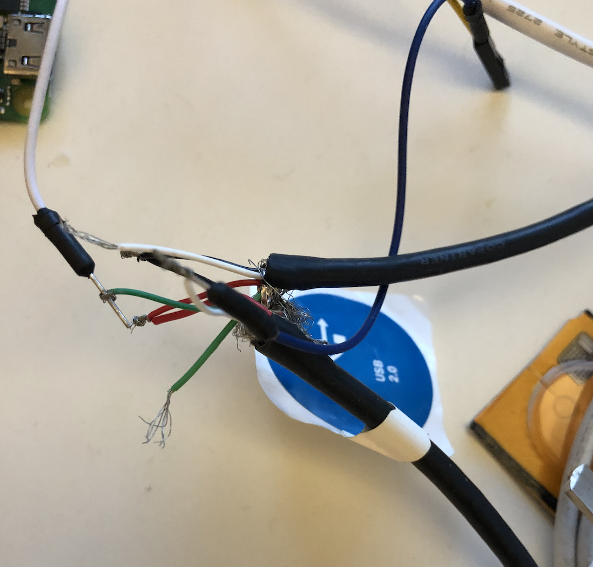
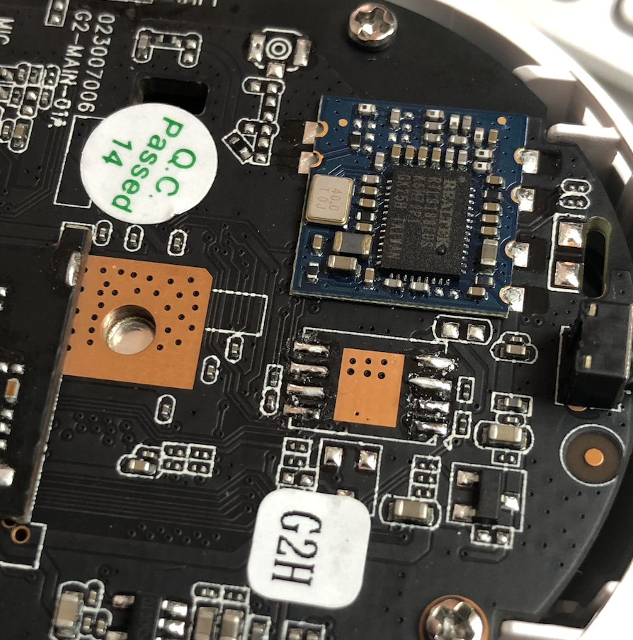
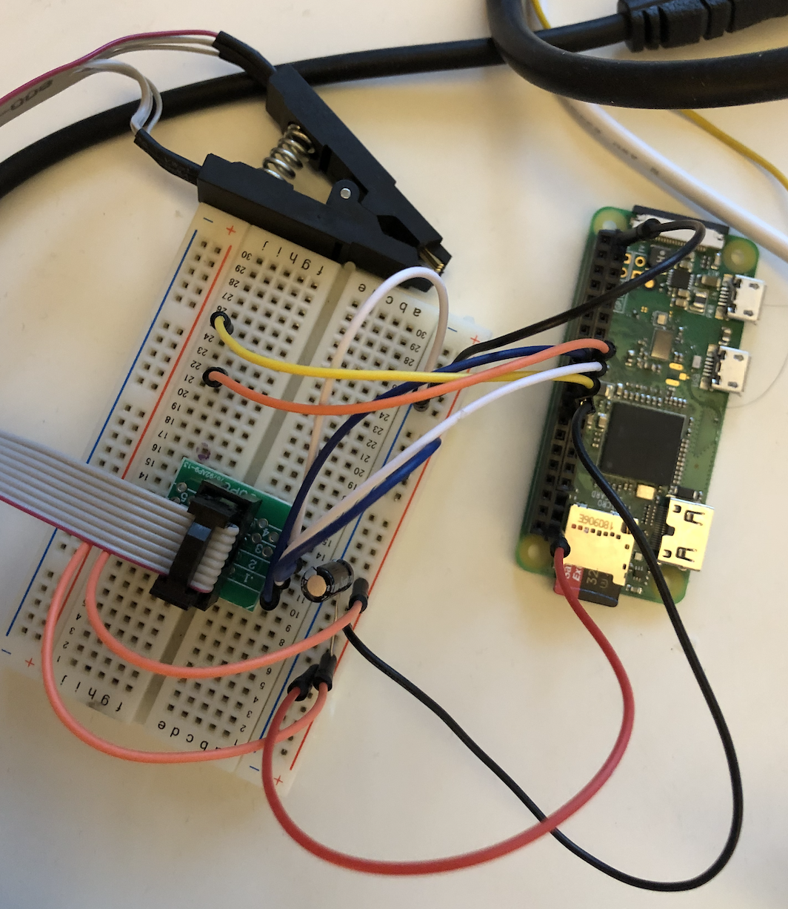
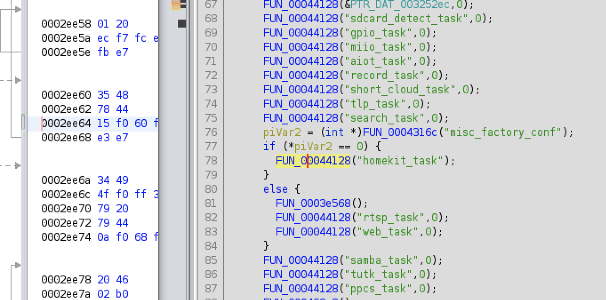

# g2h-camera-mods
 
This camera supports Homekit Secure Video for a reasonable price - but it has a couple of things that needed fixing.
 
These steps modify the G2H camera to enable RTSP, telnet, lock a few things down and not to call home. To undo these changes you should be able to do a factory reset as two full (A/B) images are stored in the SPI flash - though I have not tested this.
 
# Accessing serial console
Conveniently the USB port exposes a 3.3v TTL serial console on the D- and D+ pins. You don't even need to open the case! I spliced an old USB cable to provide the 5V input and also interface to a 3.3v FTDI adapter.
 

 
Here you will see boot logs, output logs from the camera processes.
 
As expected, you also get a password protected login prompt.
 
Unlike many other cameras, the UBoot bootloader has no wait / interrupt configured so this will not let you in.
 
# Dumping the firmware
I tried guessing the password (which locks after 3 incorrect attempts), uBoot was locked and not much in the way of services to probe, I took to reading the SPI flash.
 
Using a SIOC clip I was unable to reliably dump the firmware with the chip in place, even with a high current power supply. Finding and holding the reset pin on the Mstar SOC might have helped but removing the chip was an easier way.
Once removed the firmware was dumped using flashrom and a Pi Zero and extracted with binwalk.
 

 

 
# Getting root
My first thoughts were to modify the firmware directly, something like patching the root entry in the shadow file and boot from a modified firmware. However I didn't have a spare 32 Mbyte SPI flash to mess with and didn't want to overwrite the original as I wasn't sure the flashrom read/write was 100% accurate. This is because I saw some inconsistencies in the data dumps (this ended up being caused by a floating reset pin).
 
The shadow file had a dated descrypt hash for the root password - nothing came up online. I put John the ripper to the task of cracking it while I tried another way in...
 
I started sifting through the filesystem looking for a way in. One obvious entry point was the SD card. I could see the SD card is mounted to /mnt/sdcard, so searching the scripts and binaries for this string was a good start and pointed to the `/etc/profile`.
 
```bash
./fs_3/etc/profile:PATH="/usr/bin:/usr/sbin:/bin:/sbin:/local/bin:/local/sbin:/system/bin:/mnt/sdcard:/tmp/out"
```
 
This is useful, any file in /mnt/sdcard/ will be included in the execution path, the only problem being this is one of the last paths to be evaluated - so I can't really override a normally used command. Time to find one that is missing.
 
Checking the boot logs from the serial console and doing a search for 'not found'
 
```bash
2021-03-07 10:30:48.399775 [HK DBG]hk_exec_shell_command_and_get_result:hostname "Camera-Hub-G2H-3CB8"   ---(misc.cpp:230)
sh: hostname: not found
```
 
Bingo. All I need to do is create a file with this name in the root of the sdcard and it should be executed. I created a simple script that would echo the date into another test file on the same card. I booted and checked the contents of the sdcard and it worked.
 
No need for John the Ripper ...
 
The next part was to change the root password so I can log in from the console.
 
```bash
echo "root:password" | chpasswd
```
 
And to test...
 
```bash
Camera-Hub-G2H login: root
Password:
login[133]: root login on 'ttyS0'
 
 
BusyBox v1.24.1 (2020-09-12 16:31:03 CST) built-in shell (ash)
Enter 'help' for a list of built-in commands.
 
Welcome to Linux.
#
#
```
 
# Changing the voice to English
The default Chinese language was fixed with no way to change it. Which is fine but when you do certain tasks it would be nice to be able to understand what it was doing.
 
The audio files are stored in `/etc/ch` which are all in Mandarin. In a later version of the firmware the new audio files appeared (in folders   `en`, `es` and `ru`). There is also German, Italian and French in another partition `/customer/voice`.
 
Using a symbolic link to point each file in `/etc/ch/en/` to the corresponding file in the parent directory is an easy way to change the language to english.
 
Note that these other languages only existed after a software update, and you use the Aquara app to do the update. So I copied these from one device to another.
 
 
 
 
# Fixing Wifi
The device would not join my home wifi and it seems to be a common issue online with suggestions ranging from removing special characters from the SSID to using the Aqara app, registering and changing the country to China. This eventually ended up working but who has time for that!
 
The homekit enrollment process uses 801.11aq to announce and do network discovery, it should work really well. For some reason the scripts seem to fudge the wpa_supplicant.conf file and won't allow you to join a hidden network. A simple workaround is to constantly overwrite this file with valid details during the Homekit enrollment processes. I used a simple `while sleep 0.3` loop to do this
 
# Enabling RTSP
Other Homekit cameras I have come across wont allow RTSP when Homekit mode is enabled and I assume this is for performance reasons. But this SOC seems to be fast... Doing a string search on the main binaries that are running for rtsp revealed the `camera` binary may support rtsp.
 
Loading the binary into Ghidra and looking for references to this I can see where the function is called, and it appears to be when homekit is enabled, it wont start rtsp!
 

 
Patching this binary is trivial. As I don't want to use any of the Xiaomi/Aqara cloud functions, I will simply replace one of the other calls `miio_task` with `rtsp_task`.
 
It was harder to find a tool built into the shell that supported raw byte manipulation of these files (the stripped down sed/awk did not, there was no dd). Fortunately the included version of hexdump supported an experimental reverse (-R) function that made this possible. But with a 2MB binary this takes about 15 seconds.
 
There was also an annoying message filling the logs. I replaced this call with a NOP to stop it spamming.
 
```bash
hexdump -vC /tmp/out/camera.1 | sed -e 's/e3 f7 65 ff/f3 af 80 00/' -e 's/6d 69 69 6f 5f 74 61 73  6b 00 00 00/72 74 73 70 5f 74 61 73  6b 00 00 00/' | hexdump -R > /tmp/out/camera
```
 
And now the process is listening on port 554. And not spamming the logs.
 
```bash
# netstat -anl
Active Internet connections (servers and established)
Proto Recv-Q Send-Q Local Address           Foreign Address         State      
tcp        0      0 127.0.0.1:101           0.0.0.0:*               LISTEN     
tcp        0      0 0.0.0.0:554             0.0.0.0:*               LISTEN     
tcp        0      0 127.0.0.1:54355         0.0.0.0:*               LISTEN     
```
 
 
The service is running, but what is the URL?
 
```bash
$ ffplay rtsp://10.32.67.68/
ffplay version 4.2.2 Copyright (c) 2003-2019 the FFmpeg developers
rtsp://10.99.99.99/: Server returned 400 Bad Request
```
 
After some trial and error and searching Ghidra and online, I found the paths `/10` ...to... `/15` provide different resolutions, with and without audio.
 
 
```bash
$ ffplay rtsp://10.99.99.99/14
ffplay version 4.2.2 Copyright (c) 2003-2019 the FFmpeg developers
Input #0, rtsp, from 'rtsp://10.99.99.99/14': 0KB sq=    0B f=0/0  
 Metadata:
   title           : ww live test
 Duration: N/A, start: 0.000000, bitrate: N/A
   Stream #0:0: Video: h264 (Main), yuvj420p(pc, progressive), 1280x720, 20 fps, 20 tbr, 90k tbn, 180k tbc
   Stream #0:1: Audio: aac (LC), 16000 Hz, mono, fltp
[swscaler @ 0x7fab1e10d000] deprecated pixel format used, make sure you did set range correctly
  2.78 A-V: -0.012 fd=   0 aq=    3KB vq=   85KB sq=    0B f=0/0  
```
 
# Do not call home
 
The binaries include a bunch of chinese IPs and domain names - I am not sure if they are used when Homekit only mode is enabled (my 5 minute from boot traffic traces to indicate they did not). But I removed them anyway, just in case, simply by patching the strings in the binary to point variations of home _127.0.0.1_ and pointing these domain names to localhost also. If you don't want to do this you could also `route <dst> lo` to send the traffic to a black hole.
 
 
```bash
# /etc/hosts
127.0.0.1 cm.iotcplatform.com gm.iotcplatform.com aiot-coap-test.aqara.cn
```
 
The binary also referenced some public DNS servers, these were changed to fake addresses.
 
One of these must have been used for NTP, so manually adding NTP to the boot process solves this.
 
```bash
homekit_ntp au.pool.ntp.org
```
 
# Disabling other Miio/Xiaomi cloud processes
A tool called monitor ensures every process in `/etc/normal.xml` is running. Remove the processes that aren't needed. I just leave the camera, property and Zigbee process running.
 
 
# Rotating the picture
 
I have one of these cameras hanging upside down. The rotate function was not. Change `flip = 0` to `flip = 3` in the file `/mnt/config/flash_config.ini`. Generate a new md5sum and replace the last line of the file after the change.
 
# TL;DR
 
Clone this repo to the root of an SD card. Insert the card, power on the camera. The camera will reboot when it's done and remove the SD card. Or keep it in.. up to you. Use at your own risk.
 
Unfortunately this will probably be patched when Xiaomi is aware. But as a low risk vulnerability (need physical access to the sd card) it won't be a priority.  If you want to patch your own camera against this hack, just remove /mnt/sdcard from the PATH variable in `/etc/profile`

